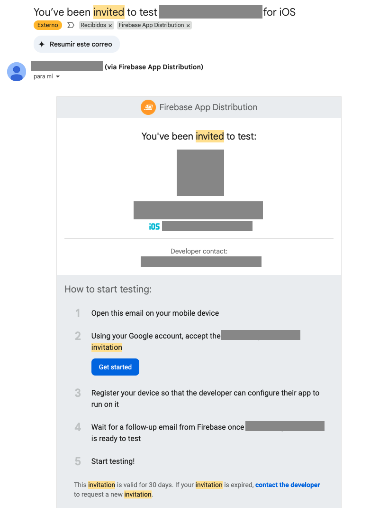
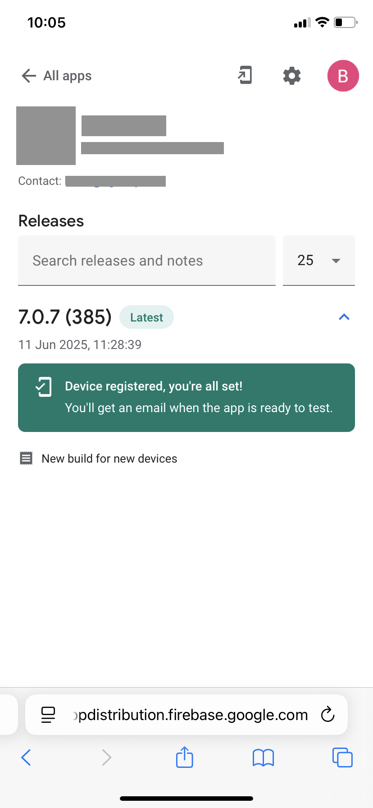
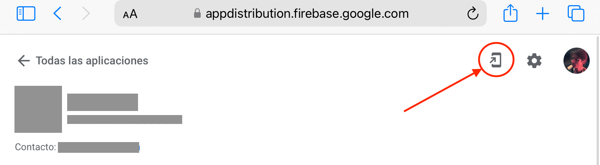
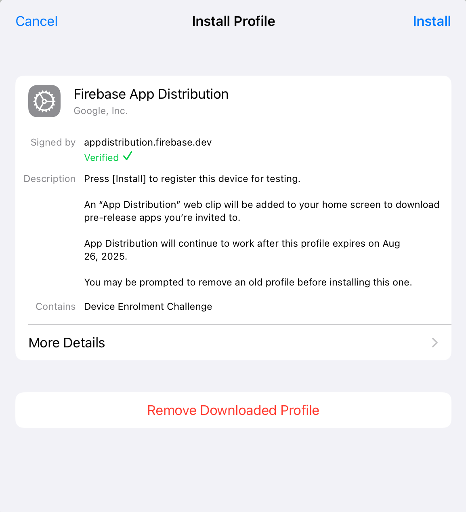

## Getting Started with Firebase App Distribution on iOS: A Tester's Guide

This tutorial provides a step-by-step guide for testers on how to install a profile for Firebase App Distribution on an iOS device. 
This process allows you to receive and test pre-release versions of applications from developers.

### 1. Accept the Invitation

The first step is to accept the email invitation sent by the developer.

* You will receive an email from Firebase inviting you to test a new app.
* Open the email on your iOS device and tap on the **"Get Started"** link. This will open a webpage in your browser.
* Sign in with your Google account to accept the invitation (make sure it's the **SAME account** as the one you received the e-mail at).

### 2. Register Your Device

After accepting the invitation, you need to register your device with Firebase App Distribution. This allows the developer to include your device's Unique Device Identifier (UDID) in the app's provisioning profile, which is necessary for installing ad-hoc builds.

* On the webpage that opens after accepting the invitation, you will be prompted to register your device.
* Tap on **"Register device"**.

After registering your device, you should see a message like this one:

    

* You will then be guided to download a configuration profile from Firebase. Tap **"Allow"** to download the profile.

    
    

If the button to download the profile is not present you can still download the profile by clicking this button.

### 3. Install the Firebase Profile

Once the profile is downloaded, you need to install it in your device's settings.

* Go to your device's **Settings** app.
* You will see a new section at the top that says **"Profile Downloaded"**. Tap on it.

    

* Tap **"Install"** in the upper-right corner. You may be prompted to enter your device's passcode.
* A warning message will appear describing what the profile does. Tap **"Install"** again.
* A final confirmation will appear. Tap **"Install"** one more time.
* Once the installation is complete, tap **"Done"**.

Your device is now registered with Firebase App Distribution.

### 4. Install the App

After you have successfully installed the profile, the developer will be notified of your device's registration. 
However, it might be intelligent to notify the developer directly if a quick response is required.

They will then need to include your device in a **NEW** build of the app. Once they distribute this new build, you will receive another email notification.

* Open the new email notification and tap the **"Download the latest build"** link.
* This will take you to the Firebase App Distribution web app, where you will see the app ready for download.
* Tap the **"Download"** button next to the app's name.
* The app will begin to install on your home screen, just like an app from the App Store.

_Congratulations! You can now open the app and begin testing!_
