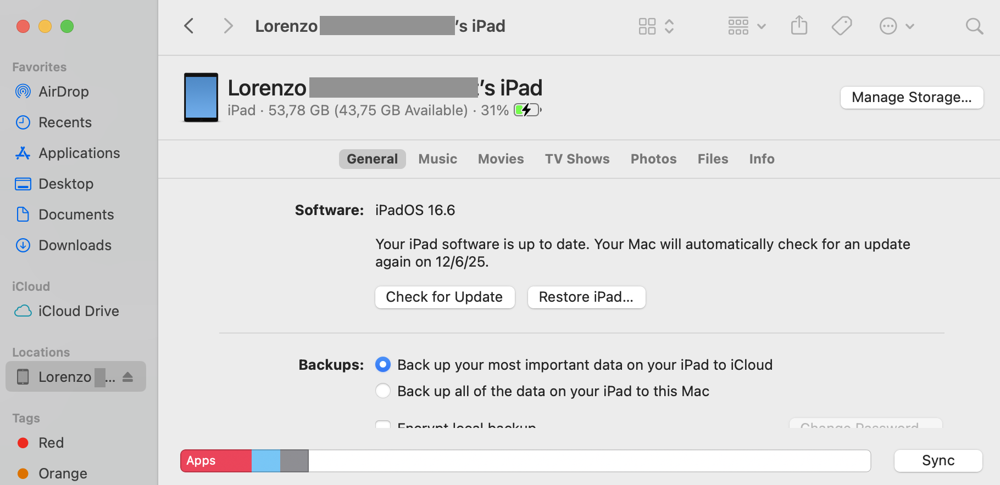
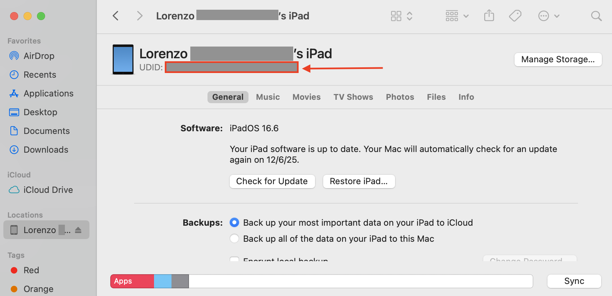

# Finding your iOS device's UDID

The Unique Device Identifier (UDID) is a specific sequence of characters that uniquely identifies your iPhone or iPad. Developers often need this ID to register your device for testing new app builds before they are released on the App Store.

Here are the most common and secure methods to find your device's UDID.

---

### Method 1: Using a Mac (macOS Catalina and newer)

On modern versions of macOS, you can easily find the UDID using the Finder.

1.  **Connect your iPhone or iPad** to your Mac using a USB cable.
2.  Open a new **Finder** window.
3.  In the Finder sidebar, look for the **Locations** section and select your connected device (e.g., "Lorenzo's iPad").

    

4.  In the main window, you will see details about your device, such as the device model and iOS version. Click on the text right below your device's name (it will initially show information like *iPhone 14 Pro, iOS 17.5*).
5.  Each click will cycle through different identifiers. Keep clicking until the **UDID** is displayed. It's a long 40-character string.

    

6.  You can right-click on the UDID to copy it to your clipboard.

---

### Method 2: Using a Windows PC or older macOS

If you are using a Windows PC or a Mac with macOS Mojave or earlier, you can use iTunes to find the UDID.

1.  **Connect your iPhone or iPad** to your computer.
2.  Open **iTunes**. If you're on Windows and don't have it, you can download it from the Microsoft Store or Apple's website.
3.  Click on the small **device icon** that appears in the top-left area of the iTunes window to go to your device's summary page.
4.  On the **Summary** tab, find the entry labeled **Serial Number**.
5.  Click on the **Serial Number** text. It will change to show your **UDID**.
6.  You can use `Ctrl+C` to copy the UDID.

---

**Important Note on Security:**

Your UDID is sensitive information. Only share it with trusted developers or organizations. Avoid using third-party websites or apps that promise to find your UDID for you, as they may pose a security risk. The methods described above are the most secure ways to obtain it.
